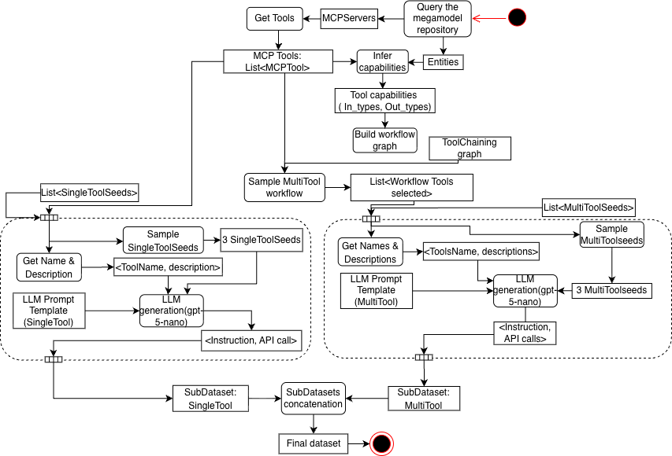

# Megamodel-Based Evaluation Framework for MDE Agents

A three-level framework for evaluating LLM-based agents in Model-Driven Engineering (MDE) contexts.

## Requirements

Install dependencies:

```bash
pip install -r requirements.txt
```

Set OpenAI API key in `.env` file at project root:

```bash
OPENAI_API_KEY=your_api_key_here
```

## Framework Overview

The megamodel provides descriptions of LLM-based agents, associated tools, underlying artifacts/models, and execution traces. It is organized in four parts: core artifacts (models, metamodels, transformation models), tooling artifacts (tools, servers), agent artifacts (agents, workflows, steps), and execution traces (traces, invocations).

- **Implementation**: `src/core/megamodel.py`
- **Population**: The megamodel is populated at agent initialization via `populate_registry()` (see `scripts/run_agent_versions.py`)

---

## Level 1: Log Injection

Extracts megamodel structure from LLM execution traces to populate the registry with tool capabilities and transformation metadata.

- **ATL Log Processing**: `logs_injection/ATL/`
  - `extract_megamodel_structure.py` - Extracts megamodel entities from ATL traces
  - `complete_langsmith_trace.txt` - Raw LangSmith trace data
  - `langsmith_final_output.json` - Processed trace output
- **EMF Log Processing**: `logs_injection/EMF/`
  - `extract_emf_megamodel_structure.py` - Extracts megamodel entities from EMF traces
  - `emf_complete_trace_final.txt` - Raw EMF trace data
  - `emf_langsmith_final_output.json` - Processed trace output

---

## Level 2: Dataset Generation

Generates synthetic instruction-API datasets from domain-specific seeds using LLM augmentation.



- **Generation Scripts**: `dataset generation/generation_process/`
  - `ATL/pipeline.py` - ATL dataset generation pipeline
  - `ATL/single_tool_generate.py` - Single-tool instruction generation
  - `ATL/multi_tool_generate.py` - Multi-tool instruction generation
  - `EMF/emf_pipeline.py` - EMF dataset generation pipeline
  - `EMF/single_tool_generate.py` - EMF single-tool instruction generation
  - `EMF/emf_multi_tool_generate.py` - EMF multi-tool instruction generation
- **Seed Instructions**: `dataset generation/seeds/`
  - `model_management_seeds/` - Model management operation seeds
  - `model_transformation_seeds/` - Transformation operation seeds
- **Generated Datasets**: `dataset generation/outputs/`
  - `atl_tools/` - ATL transformation datasets
  - `uml/` - UML transformation datasets
  - `openRewrite/` - OpenRewrite refactoring datasets

### Dataset Validation

Validates dataset diversity using six metrics from dataset augmentation research.

- **Analysis Script**: `dataset generation/analyze_dataset_diversity.py`
- **Visualization**: `dataset generation/visualize_metrics.py`
- **Metrics Calculated**:
  - Distance (average pairwise Euclidean distance)
  - Dispersion (1 - average cosine similarity)
  - Isocontour Radius (geometric mean of per-dimension standard deviations)
  - Affinity (similarity between seed and augmented dataset means)
  - Vocabulary Size (unique words)
  - Unique 3-grams (distinct 3-word sequences)
- **Output Charts**: `dataset generation/experimentation_charts/`
  - `atl_tools/` - ATL diversity metric charts
  - `uml_tools/` - UML diversity metric charts
  - `openrewrite_tools/` - OpenRewrite diversity metric charts

### Ablation Test

Tests agent performance with reduced tool availability.

- **Script**: `scripts/run_agent_reduced_tools.py`
- **Analysis**: `dataset generation/ablation_test/instruction_analysis.py`
- **Results**: `dataset generation/ablation_test/`
- **Coverage Charts**: `dataset generation/ablation_test/plots/`

---

## Level 3: Agent Benchmarking

Evaluates agent versions against generated datasets to measure accuracy and performance.

- **Agent Versions**: `regression_testing/agent_versions/` (agent1.py through agent7.py)
- **Execution Script**: `scripts/run_agent_versions.py`
- **Results**: `regression_testing/agent_version_logs/`
  - `version_1/` through `version_7/` - Execution logs per agent version
  - `report_generation.csv` - Augmented dataset results
  - `seeds_report_generation.csv` - Seed dataset results
- **Evaluation**: `regression_testing/evaluate_accuracy.py`
- **Visualization**: `regression_testing/visualize_accuracy_comparison.py`
- **Output Plots**: `regression_testing/plots/`

---

## MCP Servers

Servers expose tools via the Model Context Protocol (MCP) for agent execution.

- **ATL Server**: `mcp_servers/atl_server/` - Model transformations (includes UML transformations)
- **EMF Server**: `mcp_servers/emf_server/` - EMF model management operations
- **OpenRewrite Server**: `mcp_servers/openRewrite_servers/` - Java code refactoring and migration recipes
